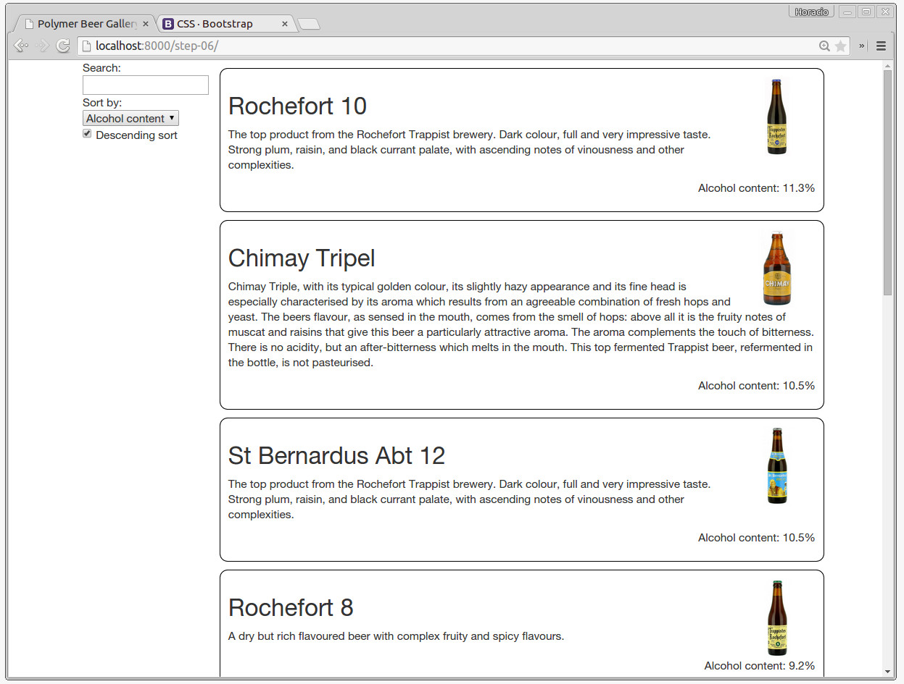
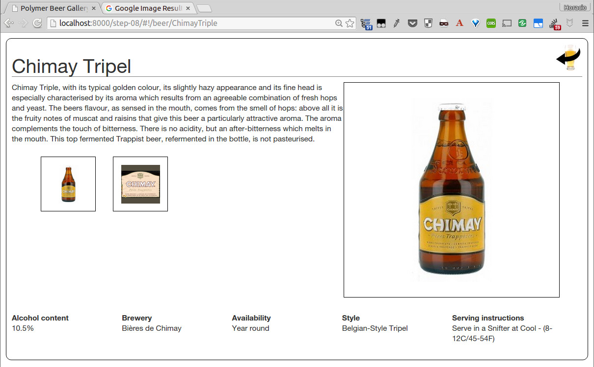

[](https://gitpod.io/#https://github.com/LostInBrittany/stencil-beers)

#   Stencil Beers

I have built this [Stencil tutorial](https://github.com/LostInBrittany/stencil-beers) as a quick entry point to [Stencil](https://stenciljs.com/). 


> ## Stencil
> Stencil is a toolchain for building reusable, scalable Design Systems. Generate small, blazing fast, and 100% standards based Web Components that run in every browser.


## What are the objectives of this tutorial

Follow the tutorial to see how web components and Stencil make browsers smarter — without the use of native extensions or plug-ins:

+ See examples of how to use client-side data binding to build dynamic views of data that change immediately in response to user actions.
+ See how Stencil keeps your views in sync with your data without the need for DOM manipulation.
+ Learn how to build technical elements to make common web tasks, such as getting data into your app, easier.

When you finish the tutorial you will be able to:

+ Create a dynamic application that works in all modern browsers.
+ Create custom elements, with its looks and its behavior encapsulated inside, setting the bases of a true component architecture client-side
+ Use data binding to wire up your data model to your views
+ Get data from a server
+ Use a router to add multipage capabilities to your application

The tutorial guides you through the entire process of building a simple application. Experiments at the end of each step provide suggestions for you to learn more about Stencil and the application you are building.

You can go through the whole tutorial in a couple of hours or you may want to spend a pleasant day really digging into it. If you're looking for a shorter introduction to Stencil, check out the [official website](https://stenciljs.com/).

  



## What do I need to use this tutorial?

The only tool stricly needed to do this tutorial is a modern web browser (ideally [Chrome](https://www.google.com/chrome/) or [Chromium](https://www.chromium.org/)). The whole tutorial can be done via the browser on [GitPod](https://gitpod.io), without installing anything in your computer. Simply click [here](https://gitpod.io/#https://github.com/LostInBrittany/stencil-beers) or in the *Open in GitPod* button bellow. 

[](https://gitpod.io/#https://github.com/LostInBrittany/stencil-beers)

> If you want to do the tutorial locally in your computer, you will need  a modern web browser (ideally [Chrome](https://www.google.com/chrome/) or [Chromium](https://www.chromium.org/)), a text editor (we suggest the excellent [Visual Studio Code](https://code.visualstudio.com/) or [Atom](https://atom.io))) and [NodeJS](https://nodejs.org).
> 
> Stencil requires a recent LTS version of NodeJS and `npm`. Make sure you've installed and/or updated Node before continuing.

## How is the tutorial organized 

The tutorial is divided in steps, each one in its own directory:


1. [First steps with Stencil](./step-01/)
1. [Using Stencil elements](./step-02/)
1. [Creating and iterating a list](./step-03/)
1. [Filtering](./step-04/)
1. [Sorting](./step-05/)
1. [Calling the server](./step-06/)
1. [Routing URLs](./step-07/)
1. [Adding the details](./step-08/)

In each step directory you have a README file that explain the objective of the step, that you will do in the working directory `app`. If you have problems or if you get lost, you also have the solution of each step in the step directories. 

So if you want to see the intended result of  the 6th step, go to the `step-06` folder and do:

```bash
cd stencil-beers
npm init
npm start
```

## What should I do now?  

OK, now you're ready to follow this tutorial. Simply click [here](https://gitpod.io/#https://github.com/LostInBrittany/stencil-beers) or in the *Open in GitPod* button bellow. 

[](https://gitpod.io/#https://github.com/LostInBrittany/stencil-beers)

Now can go to [step-01](./step-01) and begin to follow the README of that step. Let's begin!
