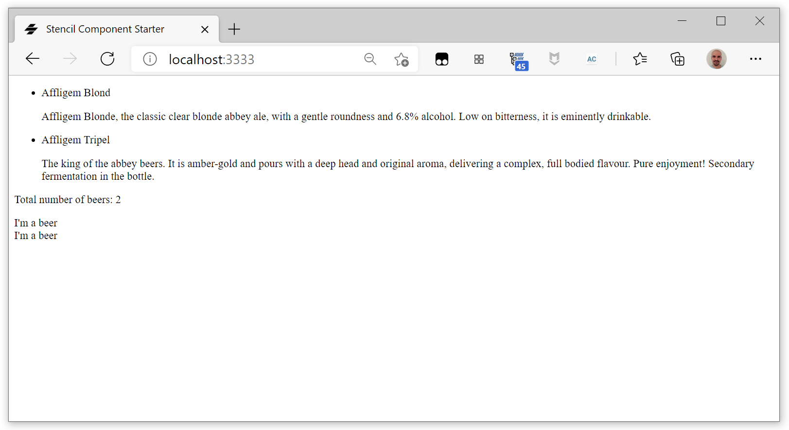
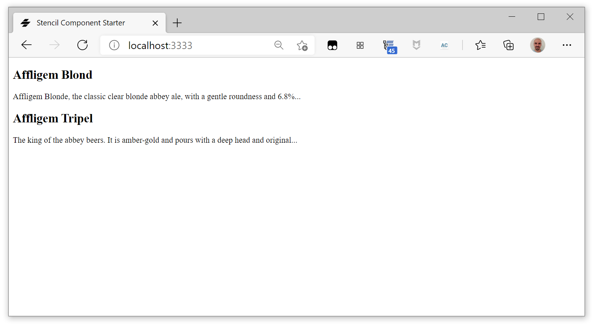
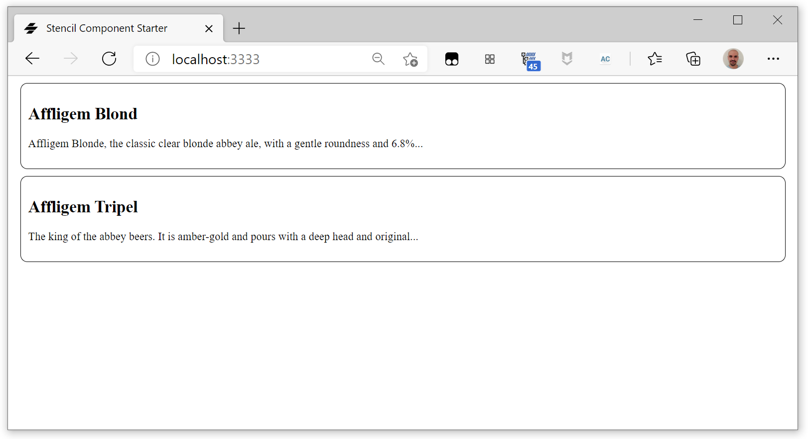

#  Stencil Beers - Step 02: Using Stencil elements

In this step we are going to use our first Stencil, a very simple custom element to render a beer inside a list of beer. Keeping it simple, we call it `beer-list-item`.

We are creating this `beer-list-item` as a Stencil component, i.e. a [Web Component] (https://developer.mozilla.org/en-US/docs/Web/Web_Components). As all other Stencil components in your collection, it will be in its own folder inside `src/components`.

> By specification, the custom element's name must start with a lower-case ASCII letter and must contain a dash (`-`). And by convention, the name should be all lowercase, and use dashes to separate words, that's why we get the `beer-list-item` name.

## The `beer-list-item` component

You're going to define your first element, `beer-list-item`. Let's begin by creating a `beer-list-item` folder inside `src/components`. Inside it, create a `beer-list-item.tsx` folder:

```tsx
import { Component, h } from '@stencil/core';

@Component({
  tag: 'beer-list-item'
})
export class BeerListItem {
}
```

The `@Component` decorator provides metadata about our component to the Stencil compiler. For the moment we have only declared the `tag` property, that will the the custom HTML tag for our component.

*For more information about the `@Component` decorator, see the [official documentation](https://stenciljs.com/docs/component).*

## Rendering the component

Next thing our component need is a `render()` method, that returns a tree of components that are rendered to the DOM at runtime. This `render` method use JSX a popular, declarative template syntax.  


```tsx
render() {
    return <div class="container">
        I'm a beer
    </div>;
}
```

> In order to compile the JSX code, you need to import the `h` function from `@stencil/core`, as we have done when creating the component.

*You can find more information about using JSX in Stencil in the [official documentation](https://stenciljs.com/docs/templating-jsx).*


We can already add a `beer-list-item` component to our `index.html` file, and it will be nicely rendered:

```html  
<body>
    <div class="container">
      <ul>
        <li>
          <span>Affligem Blond</span>
          <p>Affligem Blonde, the classic clear blonde abbey ale, 
              with a gentle roundness and 6.8% alcohol. Low on 
              bitterness, it is eminently drinkable.</p>
        </li>
        <li>
          <span>Affligem Tripel</span>
          <p>The king of the abbey beers. It is amber-gold and 
              pours with a deep head and original aroma, delivering 
              a complex, full bodied flavour. Pure enjoyment! 
              Secondary fermentation in the bottle.</p>
        </li>
      </ul>
      
      <p>Total number of beers: 2</p>

      <beer-list-item></beer-list-item>
      <beer-list-item></beer-list-item>
    </div>
  </body>
```




## Local DOM and data binding 

Data binding binds a property or sub-property of a component (the host element) to a property or attribute of another component in its local DOM (the child or target element).

The standard way to create the binding in Stencil is using the `render()` method. Inside it we can callfor the objects properties using the standard JSX syntax (`{this.property_name}`).

The `render()` method is called after any property change is detected.

To bind to a child property, specify the attribute name that corresponds to the property, with an annotation as the attribute value:

```html
<beer-list-item
  name="Affligem Tripel"
  description="The king of the abbey beers. It is amber-gold and pours with a deep head and original..."
></beer-list-item>
```

Here we are defining an instance of `beer-list-item`  component binding the component `name` property to `"Affligem Tripel"` and the `description` to `"The king of the abbey beers. It is amber-gold and pours with a deep head and original..."`.


## Adding some Props

As we have just seen, we want our `beer-list-item` to show the characteristics of a beer inside a beer list. In order to do it, we need a way to make these characteristics available to the `render()` method. Thats the role of Props.

Props are custom attribute/properties exposed publicly on the element that developers can provide values for. They are used to pass data down from the parent component to the child component. Components need to explicitly declare the Props they expect to receive using the `@Prop()` decorator. 

In our case, we want our `beer-list-item` to display the name and the description of the beer, so those are the Props we need to declare.

Let's begin by importing the `Prop` decorator:

```tsx
import { Component, Prop, h } from '@stencil/core';
```

And then use it in the `BeerListItem` class to define our two Props:

```tsx
    @Prop() name: string;
    @Prop() description: string;
```

Now you can access them in the `render()` method by using `this`:

```tsx
    render() {
        return <div class="beer">
            <h2> {this.name} </h2>
            <p> {this.description} </p>
        </div>;
    }
```

Now you can use the `beer-list-item` components from `index.html` and give them the right name and description. Replace the full-HTML list with your new `beer-list-item` components:

```html
<div class="container">
    <beer-list-item
    name="Affligem Blond"
    description="Affligem Blonde, the classic clear blonde abbey ale, with a gentle roundness and 6.8%..."
    ></beer-list-item>

    <beer-list-item
    name="Affligem Tripel"
    description="The king of the abbey beers. It is amber-gold and pours with a deep head and original..."
    ></beer-list-item>
</div>
```



*For more information about Props, see the [official documentation](https://stenciljs.com/docs/properties).*


## Making it prettier


Let's add a external CSS file to our component. In the component folder, create a `beer-list-item.css` file, with this minimal CSS:

```css
.beer {
    margin: 10px;
    padding: 10px;
    border: solid 1px black;
    border-radius: 10px;
    min-height: 50px;
}
```

Now let's say to our component to use that CSS file:

```tsx
@Component({
  tag: 'beer-list-item',
  styleUrl: 'beer-list-item.css',
})
```

And the rendering is updated to show the border for each item:




## Additional experiments

Try modifying the element to show the beer name in red.

You will see that you need to do it inside the `beer-list-item` CSS file.

## Summary

You have added a Stencil custom web component to an otherwise static app. Now go to [step-03](../step-03/) to see how to create another element to automatically generate the beer list.