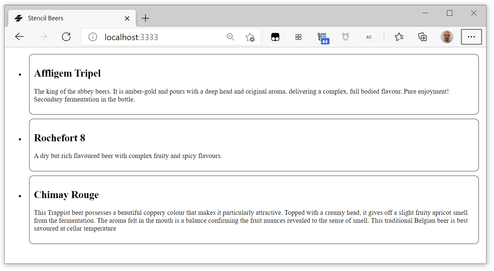
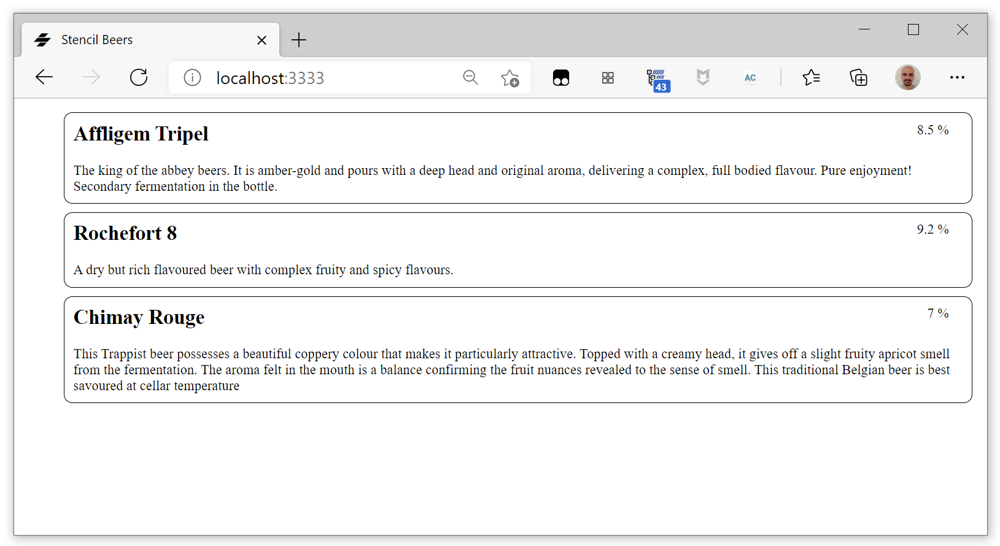

#  Stencil Beers - Step 03: Creating and iterating a list


In this step we are going to create a more complex Stencil component, a custom `beer-list`. This element will use a TypeScript array as model and automatically generate a `beer-list-item` for each beer in the array.


## Creating the component


Begin by creating a new folder fore the component, `src/components/beer-list`. Inside it, create the TypeScript file to define the component, `beer-list.tsx`, and the associated CSS file, `beer-list.css`.

In the TypeScrip file, declare the component:


```tsx
import { Component, Prop, h } from '@stencil/core';

@Component({
  tag: 'beer-list',
  styleUrl: 'beer-list.css',
})
export class BeerList {
    render() {
        return <div></div>
    }
}
```

## Defining the model

We are going to model a beer object as a `Beer` TypeScript item, and our (ever growing) beer collection as a TypeScript array of `Beer`.

In the `src/utils` folder, add a `beer.ts` file:

```ts
export interface Beer {
    name: string,
    description: string,
    alcohol: number,
}

export const beerList: Array<Beer> =  [
  {
    alcohol: 8.5,
    name: "Affligem Tripel",
    description: "The king of the abbey beers. It is amber-gold and pours with a deep head and original aroma, delivering a complex, full bodied flavour. Pure enjoyment! Secondary fermentation in the bottle."
  },
  {
    alcohol: 9.2,
    name: "Rochefort 8",
    description: "A dry but rich flavoured beer with complex fruity and spicy flavours."
  },
  {
    alcohol: 7,
    name: "Chimay Rouge",
    description: "This Trappist beer possesses a beautiful coppery colour that makes it particularly attractive. Topped with a creamy head, it gives off a slight fruity apricot smell from the fermentation. The aroma felt in the mouth is a balance confirming the fruit nuances revealed to the sense of smell. This traditional Belgian beer is best savoured at cellar temperature "
  }
];

```

## Importing the model

Now we can import our `beerList` into the `beer-list` component:

```tsx
import { beerList } from '../../utils/beers';
```

And we are going to declare the beer list with the `@State` decorator. The `@State()` decorator is used to manage internal data for a component. Any changes to a `@State()` property will cause the components render function to be called again.

Import the `@State` decorator:

```tsx
import { Component, Prop, State, h } from '@stencil/core';
```

And add a beer list state to the component:

```tsx
    @State() beers: Array<Beer>;
```

*For more information on the `@State` decorator, see the [official documentation](https://stenciljs.com/docs/state).*


## Initializing the state

In order to initialize the state, we are going to use the `componentWillLoad()` lifecycle method. 

Components have numerous lifecycle methods which can be used to know when the component "will" and "did" load, update, and render. These methods can be added to a component to hook into operations at the right time.

The `componentWillLoad()` method is called once just after the component is first connected to the DOM. Since this method is only called once, it's a good place to load data asynchronously.

Let's use it to initialize `list`:

```tsx
    componentWillLoad() {
    this.beers = beerList;
}
```

*For more information on Stencil lifecycle methods, see the [official documentation](https://stenciljs.com/docs/component-lifecycle).*

## Iterating the list


Now we want that for each `Beer` in `list`, the `render()` method generates one `beer-list-item` component, i.e. we need to create a loop in the `render()` method.

Loops can be created in JSX using array operators such as `map` when inlined in existing JSX. 

In our case:

```tsx
    render() {
        return <ul class="beers">
            {this.beers.map((beer: Beer) => {
                return <li>
                    <beer-list-item 
                        name={beer.name} 
                        description={beer.description}></beer-list-item>
                </li>;
            })}
        </ul>
    }
```

The [`map()`](https://developer.mozilla.org/en-US/docs/Web/JavaScript/Reference/Global_Objects/Array/map) array method creates a new array with the results of calling a provided function on every element in the calling array.

In this case, for each `beer` in the `beers` list, it generates an `<beer-list-item>` component.

Now we can use `beer-list` in our `index.html`:

```html
<!DOCTYPE html>
<html dir="ltr" lang="en">
  <head>
    <meta charset="utf-8" />
    <meta name="viewport" content="width=device-width, initial-scale=1.0, minimum-scale=1.0, maximum-scale=5.0" />
    <title>Stencil Beers</title>

    <script type="module" src="/build/stencil-beers.esm.js"></script>
    <script nomodule src="/build/stencil-beers.js"></script>
  </head>
  <body>
    <beer-list></beer-list>
  </body>
</html>
```




## Making it prettier

Let's add some CSS code to `beer-list.css` to hide those bullet points before ever `beer-list-item`:

```css
.beers {
    list-style-type: none;
}
```

Let's also refactor `beer-list-item` with a new Prop, alcohol:


```tsx
    @Prop() name: string;
    @Prop() description: string;
    @Prop() alcohol: number

    render() {
        return <div class="beer">
            <div class="alcohol">{this.alcohol} %</div>
            <h2 class="name"> {this.name} </h2>
            <div class="description"> {this.description}</div>
        </div>;
    }
```

And some CSS to position it:

```css
.beer > h2 {
    margin-top: 0;
}

.beer > .alcohol {
    float: right;
    margin-right: 16px;
}
```

Now we can refactor `beer-list` to also send the `alcohol`:

```tsx
    render() {
        return <ul class="beers">
            {this.beers.map((beer: Beer) => {
                return <li>
                    <beer-list-item 
                        name={beer.name} 
                        description={beer.description}
                        alcohol={beer.alcohol}></beer-list-item>
                </li>;
            })}
        </ul>
    }
```

And we have our application that begins to look nifty...



## Let's add some Bootstrap

Now we are going to add some [Bootstrap](https://getbootstrap.com/) look and feel to your components. 

First of all, get Bootstrap 5 using `npm`:

```bash
npm i bootstrap@^5.0.0-beta1
```

Now edit your application global Stencil configuration file, `stencil.config.ts`, and add an optional `globalStyle` setting that points to the Bootstrap CSS:


```ts
export const config: Config = {
  namespace: 'stencil-beers',
  globalStyle: 'node_modules/boostrap/dist/css/bootstrap.min.css',
  [...]
}
```

The Stencil compiler will now run the same minification, autoprefixing and plugins over the global CSS file and generate an output file for the `www` and `dist` output targets. The generated file will always have the `.css` extension and be named as the specified namespace, i.e. in our case `stencil-beers.css`.

We need to manually load this file in the `index.html` file:

```html
<link rel="stylesheet" href="/build/stencil-beers.css">
```

We can now also add a `container` class to the `beer-list` and `beerlist-item` renderers:

```tsx
    render() {
        return <ul class="container beers">
            {this.beers.map((beer: Beer) => {
                return <li>
                    <beer-list-item 
                        name={beer.name} 
                        description={beer.description}
                        alcohol={beer.alcohol}></beer-list-item>
                </li>;
            })}
        </ul>
    }
```

```tsx
    render() {
        return <div class="container beer">
            <div class="alcohol">{this.alcohol} %</div>
            <h2 class="name"> {this.name} </h2>
            <div class="description"> {this.description}</div>
        </div>;
    }
```


So now the beers are rendered inside a Bootstrap [container](https://getbootstrap.com/docs/4.1/layout/overview/#containers) element, as you can see with the margins.


## Aditionnal experiments

### Make the `beer-list` element show the number of beers in the list.

In the `beer-list` renderer you have access to the beers variable, you can then get it's size and show it after the beers:

```tsx
<div>Number of beers in list: {this.beers.length}</div>
```

### Play with loops

Create a loop in `beer-list` that constructs a simple table:

```tsx
<table>
  <tr><th>Row number</th></tr>
  {[0, 1, 2, 3, 4, 5, 6, 7].map((item) => <tr><td>{item}</td></tr>)}
</table>
```

Extra points: try and make an 8x8 table using an additional loop.


## Summary ##

You now have a web application using Stencil web components.
Now, let's go to [step-04](../step-04/) to learn how to add full text search to the app.
