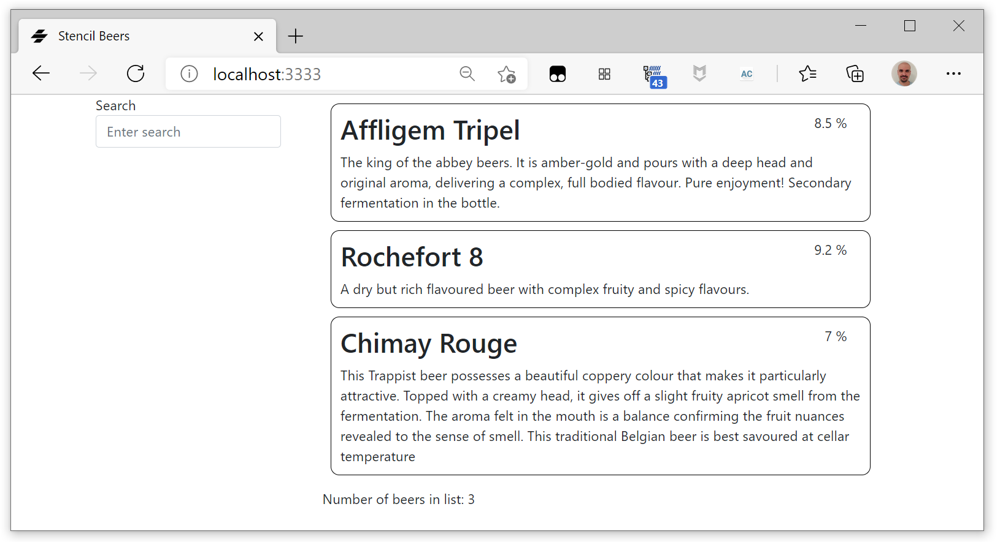
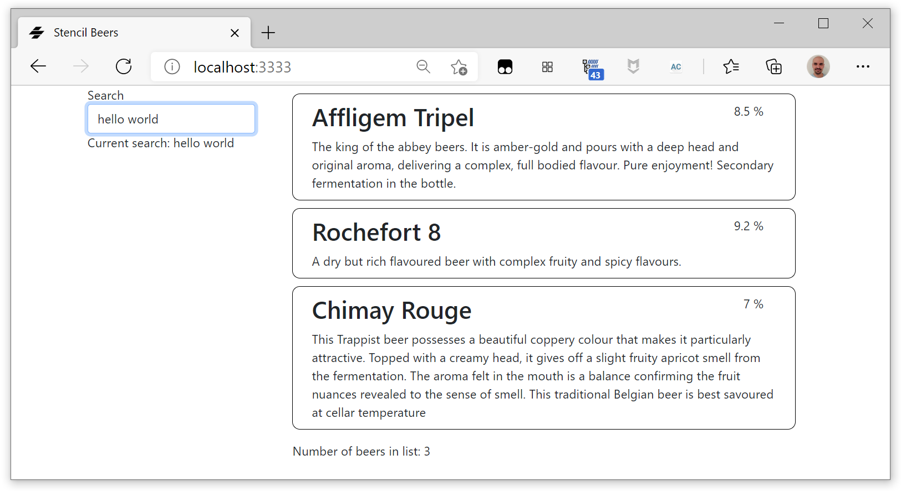
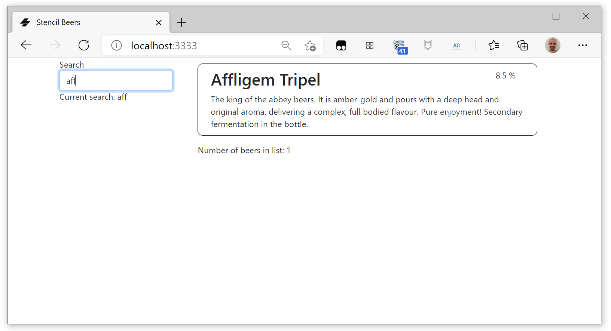

#  Stencil Beers - Step 04: Filtering

We did a lot of work in laying a foundation for the app in the last step, so now we'll do something simple: we will add full text search (yes, it will be simple!).

We want to add a search box to the app, and we want the results on the beer list change according to what the user types into the search box.

## Modifying `beer-list` rendering


We use [Bootstrap](http://getbootstrap.com) column model to divide the page in two (fully responsive) columns, the left one for the search box, the right one for the beer list.

We need to add a standard HTML `<input>` tag, give them some magical data-binding properties and adding a filter function to process the input for the template rendering.

This lets a user enter search criteria and immediately see the effects of their search on the beer list.  

Let's begin by modifying the `render()` method to add the search input.

```tsx
    render() {
        return <div class="container">
            <div class="row">
                <div class="col-md-3">
                    <div class="form-group">
                    <label 
                        htmlFor="search">
                        Search
                    </label>
                    <input 
                        type="text" 
                        class="form-control" 
                        id="search"  
                        placeholder="Enter search"></input>
                    </div>
                </div>
                <div class="col-md-9">
                    <ul class="container beers">
                        {this.beers.map((beer: Beer) => {
                            return <li>
                                <beer-list-item 
                                    name={beer.name} 
                                    description={beer.description}
                                    alcohol={beer.alcohol}></beer-list-item>
                            </li>;
                        })}
                    </ul>
                    <div class="container">
                        Number of beers in list: {this.beers.length}
                    </div>
                </div>  
          </div>        
        </div>;
    }
```




## Linking state to events

Now we want to modify the internal state of `beer-list` according to the value introduced in the `search` input field. As we saw in precedents steps, for the internal state we will use `@State()`, but how do we listen to the value of the input field? We can simply use the `onInput` attribute:

```tsx
    <input 
        type="text" 
        class="form-control" 
        id="search"
        onInput={(evt) => this.doFilter(evt)}  
        placeholder="Enter search"></input>
```

Now we can create a `@State()` for the filtering pattern, and a `doFilter()` method to modify it accordingly to the value of the input:

```tsx
@State() pattern: string;

doFilter(evt: Event) {
    this.pattern = (evt.target as HTMLInputElement).value;
} 
```

And in the renderer we can verify it works by adding a new label under the input field:

```tsx
<div>Current search: {this.pattern}</div>
```

Now we have a two-way data-binding between the input field and the label under it.




## Adding a filter to the list

To filter or sort the displayed items in your list, add a [`filter()`](https://developer.mozilla.org/en-US/docs/Web/JavaScript/Reference/Global_Objects/Array/filter) function to the rendering of the beer list:

```tsx
 <ul class="container beers">
    {this.beers
    .filter( (beer: Beer) => {
        return beer.name 
            && beer.name.match(new RegExp(this.pattern, 'i'));
        })
    .map((beer: Beer) => {
        return <li>
            <beer-list-item 
                name={beer.name} 
                description={beer.description}
                alcohol={beer.alcohol}></beer-list-item>
        </li>;
    })}
</ul>
```              


## Additional experiments

You have maybe noticed it, the *total beers* that you added in the *additional experiments* section some steps ago shows only that, the total. It would be nice if it showed the *current beers* metric, i.e. the number of beers currently showed in page, after filtering.

How could you do it? Instead of using the `beers` property, we can use a function to compute the total number of beers.

In the `render()` method:

```js
<div>Number of beers in list: {this._currentBeers()}</div>
```

And then: 

```js
_currentBeers() {
  // Do something clever...
},
```

Inside the function we can go through `beers` and counting the beers that match the `beerFilter` filter...





## Summary ##

We have now added full text search! Now let's go on to [step-05](../step-05) to learn how to add sorting capability to the beer app.

