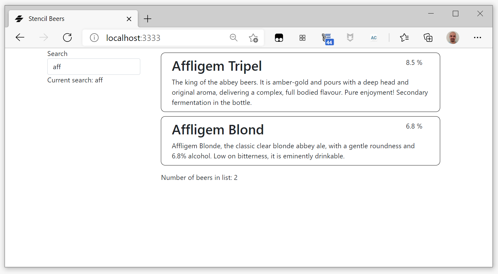
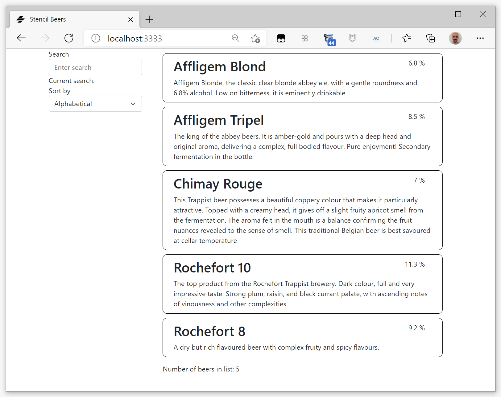
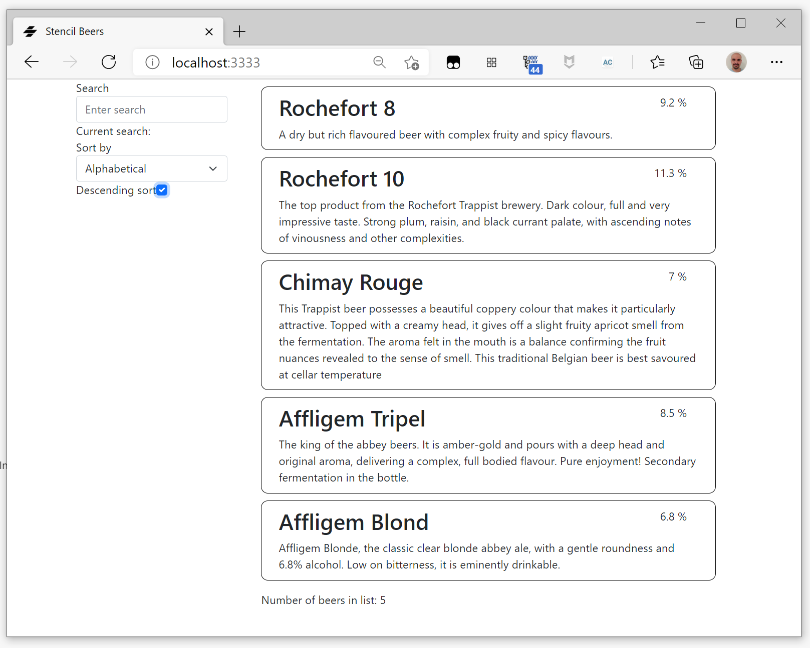

#  Stencil Beers - Step 05: Sorting


In this step, you will add a feature to let your users control the order of the items in the beer list. The dynamic ordering is implemented by creating a new model property, wiring it together with the repeater, and letting the data binding magic do the rest of the work.

In addition to the search box, the app displays a drop down menu that allows users to control the order in which the beers are listed.

## Adding some more beers

To better see the filtering and sorting capabilities, let's add some more beers to our model:

```tsx
export const beerList: Array<Beer> = [
  {
    "alcohol": 6.8,
    "name": "Affligem Blond",
    "description": "Affligem Blonde, the classic clear blonde abbey ale, with a gentle roundness and 6.8% alcohol. Low on bitterness, it is eminently drinkable."
  },
  {
    "alcohol": 8.5,
    "name": "Affligem Tripel",
    "description": "The king of the abbey beers. It is amber-gold and pours with a deep head and original aroma, delivering a complex, full bodied flavour. Pure enjoyment! Secondary fermentation in the bottle."
  },
  {
    "alcohol": 9.2,
    "name": "Rochefort 8",
    "description": "A dry but rich flavoured beer with complex fruity and spicy flavours."
  },
  {
    "alcohol": 11.3,
    "name": "Rochefort 10",
    "description": "The top product from the Rochefort Trappist brewery. Dark colour, full and very impressive taste. Strong plum, raisin, and black currant palate, with ascending notes of vinousness and other complexities."
  },
  {
    "alcohol": 7,
    "name": "Chimay Rouge",
    "description": "This Trappist beer possesses a beautiful coppery colour that makes it particularly attractive. Topped with a creamy head, it gives off a slight fruity apricot smell from the fermentation. The aroma felt in the mouth is a balance confirming the fruit nuances revealed to the sense of smell. This traditional Belgian beer is best savoured at cellar temperature "
  }
];
```  


## Sorting beers by alcohol content


As we did for the filter, we add a [`sort()`](https://developer.mozilla.org/en-US/docs/Web/JavaScript/Reference/Global_Objects/Array/sort) function to the rendering of the beer list:

```tsx
<ul class="container beers">
    {this.beers
    .filter( (beer: Beer) => {
        return beer.name 
            && beer.name.match(new RegExp(this.pattern, 'i'));
        })
    .sort((a,b) => this._beerSorter(a,b))
    .map((beer: Beer) => {
        return <li>
            <beer-list-item 
                name={beer.name} 
                description={beer.description}
                alcohol={beer.alcohol}></beer-list-item>
        </li>;
    })}
</ul>
```


And we define our sorting function:

```tsx
  _beerSorter(a:Beer, b:Beer): number {
    if (a.alcohol === b.alcohol) return 0;
    return b.alcohol - a.alcohol;
  }
```

And it works!



So now we have our beers ordered by alcohol content. But let's do a more flexible order function...


## Selecting order criteria


First, we define in `stc/utils/beers.ts` an interface for the sorting criterion and a list of our criteria:

```tsx
export interface sortingCriterion {
    name: string,
    label: string,
};

export const sortingCriteria: Array<sortingCriterion> = [
  { name: "name", label: "Alphabetical"},
  { name: "alcohol", label: "Alcohol content" }
];  
```

We import these new definitions in `beer-list`:

```tsx
import { beerList, Beer, sortingCriteria, sortingCriterion } from '../../utils/beers';
```

Then we add a `<select>` html element named `orderProp`, so that our users can pick from the two provided sorting options.

```tsx        
<label 
    htmlFor="sort">
    Sort by
</label>
<select 
    id="sort" 
    class="form-select">
    { sortingCriteria.map((item) => <option value={item.name}> {item.label}</option>) }
</select>
```


And we add a `criterion` State:

```tsx
@State() criterion: sortingCriterion;
```

We initialize it to the first of the available `sortingCriteria` in `componentWillLoad()`:

```tsx
    this.criterion = sortingCriteria[0];
```

Then we modify the sort function to sort according to the chosen property:

```tsx
_beerSorter(a:Beer, b:Beer) {  
    if ( a[this.criterion.name] === b[this.criterion.name] ) return 0;
    if ( a[this.criterion.name] < b[this.criterion.name] ) return -1;
    if ( a[this.criterion.name] > b[this.criterion.name] ) return 1;      
}
```


Now we need to call a function when the sorting criteria changes. We add an `onChange` attribute to the select:

```tsx
<select 
    id="sort" 
    class="form-select"
    onChange={(evt) => this._sortingChanged(evt)}>
    { sortingCriteria.map((item) => <option value={item.name}> {item.label}</option>) }
</select>
```

And the function to deal with it:

```tsx
_sortingChanged(evt: Event) {
    this.criterion = { 
        name: (evt.target as HTMLSelectElement).selectedOptions[0].value,
        label: (evt.target as HTMLSelectElement).selectedOptions[0].text,
    }
}
```




## Ascending or descending

By default our sorter sorts in ascending order. Let's add a checkbox to give us descending sort capabilities.


```tsx
<label htmlFor="descending">Descending sort</label>
<input 
    id="descending" 
    type="checkbox" 
    class="form-check-input"
    onChange={(evt) => this._descendingChange(evt)}></input>
```

We add a `descendingSort` State:

```tsx
@State() descendingSort: boolean;
```

That we initialize it to `false` in `componentWillLoad()`:

```tsx
    this.descendingSort = false;
```


And a `_descendingChange` handling function:

```tsx
_descendingChange(evt: Event) {
    this.descendingSort = (evt.target as HTMLInputElement).checked;
}
```

And then we modify the sort to inverse the order if the `descendingSort` property is true:

```tsx
_beerSorter(a:Beer, b:Beer) {  
    var invert = 1;
    if (this.descendingSort) invert = -1;
    if ( a[this.criterion.name] === b[this.criterion.name] ) return 0;
    if ( a[this.criterion.name] < b[this.criterion.name] ) return -1*invert;
    if ( a[this.criterion.name] > b[this.criterion.name] ) return 1*invert;      
}

```



## Summary ##

Now that you have added list sorting, go to [step 6](../step-06) to learn how to dynamically load our beer data from a server-side JSON file.
