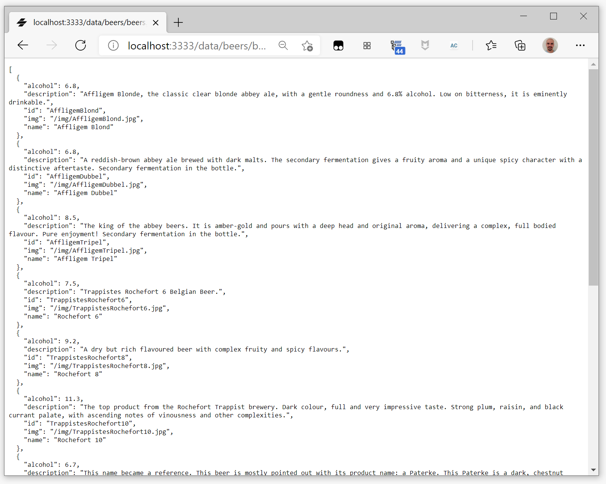
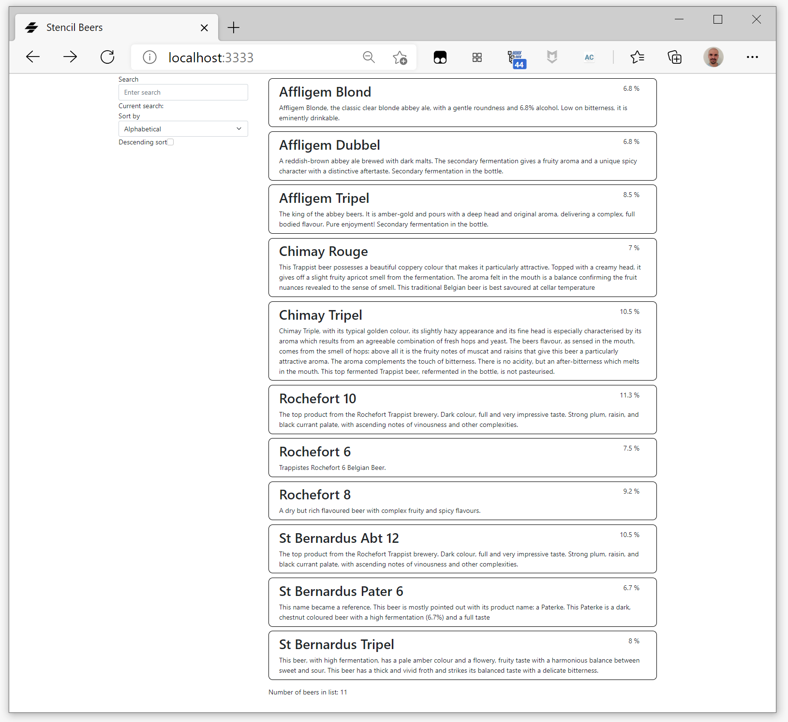
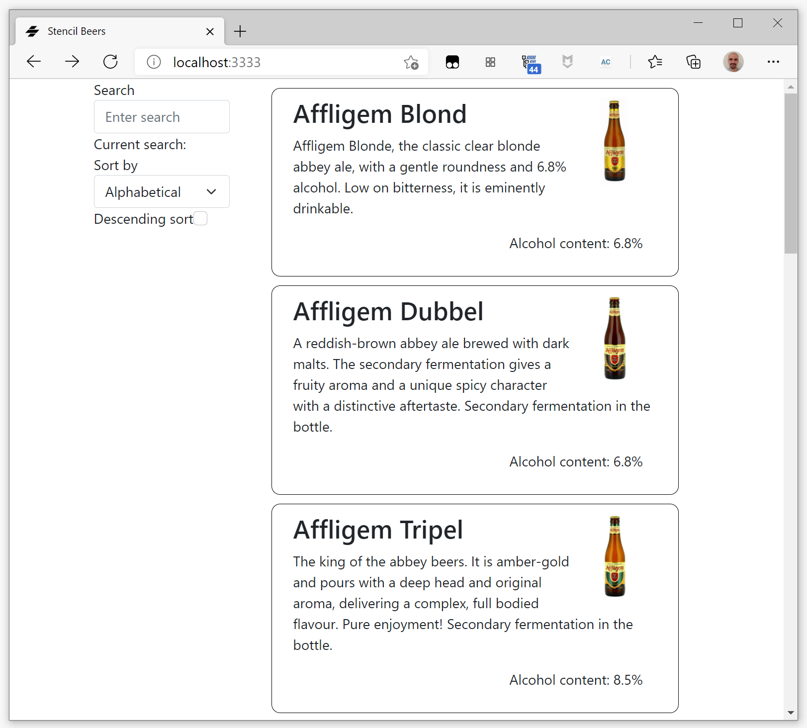

#  Stencil Beers - Step 06: Calling the server


Enough of building an app with five beers in a hard-coded dataset! Let's fetch a larger dataset from our server using the [JavaScript Fetch API](https://developer.mozilla.org/en-US/docs/Web/API/Fetch_API).

## Data 

Our new dataset is now a list of 11 beers stored in JSON format in the `/data/beers/beers.json`. Begin by copying it to a `src/data/beers/beers.json` inside your application.

Now you need to tell Stencil to copy the `src/data` folder into the distribution folder, i.e. to make it available to the compiled application. To do it, open your application's global Stencil configuration file `stencil.config.ts`, and add the `copy` tasks:

```tsx
import { Config } from '@stencil/core';

export const config: Config = {
  namespace: 'stencil-beers',
  globalStyle: 'node_modules/bootstrap/dist/css/bootstrap.min.css',
  outputTargets: [
    {
      type: 'dist',
      esmLoaderPath: '../loader',
      copy: [
        { src: 'data' }
      ],
    },
    {
      type: 'dist-custom-elements-bundle',
    },
    {
      type: 'docs-readme',
    },
    {
      type: 'www',
      serviceWorker: null, // disable service workers
      copy: [
        { src: 'data' }
      ],
    },
  ],
};
```

Now the JSON file is available to your browser at the URL `http://127.0.0.1:3333/data/beers/beers.json`.





## Fetch API

To get the JSON data from the server we are using the [JavaScript Fetch API](https://developer.mozilla.org/en-US/docs/Web/API/Fetch_API) to make an HTTP GET request to our web server, asking for `/data/beers/beers.json`. The server responds by providing the data in the JSON file. (The response might just as well have been dynamically generated by a backend server. To the browser and our app they both look the same. For the sake of simplicity we used a JSON file in this tutorial).

As the `fetch` operation is asynchronous, we are using the [`async/await`](https://developer.mozilla.org/en-US/docs/Web/JavaScript/Reference/Statements/async_function) syntax make the asynchronous code easier to read and write.

We want to call for the data as soon as our `beer-list` element get loaded, so we use `componentWillLoad()`:

```tsx
    componentWillLoad() {
        this.beers = beerList;
        this.criterion = sortingCriteria[0];
        this.descendingSort = false;
        this._getData();
    }

    async _getData() {
        try {
            const response = await fetch('/data/beers/beers.json');
            this.beers = await response.json();
        }
        catch (err) {
            console.log('fetch failed', err);
        }
    }
```
And now you should have 11 beers in your collection:




## Showing more information

As now we recover more information for each beer (an id and an image URL), we are going to modify `beer-list-item` element to show it.

We begin by adding the missing properties:

```tsx
@Prop() id: string;
@Prop() name: string;
@Prop() description: string;
@Prop() alcohol: number;
@Prop() img: string;
```

Then we modify the `render()` method, displaying more information on each beer:

```tsx
  render() {
    return html`
      <style>
        .beer {
          margin: 10px;
          padding: 10px;
          border: solid 1px black;
          border-radius: 10px;
          min-height: 150px;
        }
        .el-img {
          max-height: 100px;
        }
        .el-alcohol {
          clear:both;
        }
      </style>
    render() {
        return <div class="container clearfix beer">            
            </img>
            <h2 class="name">{this.name}</h2>
            <p class="description">{this.description}</p>
            <p class="float-end alcohol">Alcohol content: {this.alcohol}%</p>
        </div>;
    }
    `;
  }
```

And we add some CSS to make things prettier:

```css
.beer {
    margin: 10px;
    padding: 10px;
    border: solid 1px black;
    border-radius: 10px;
    min-height: 50px;
}

.beer > h2 {
    margin-top: 0;
}

.beer > .alcohol {
    margin-right: 16px;
}

.beer > .img {
    max-height: 100px;
}

.beer > .alcohol {
    clear:both;
}
```

## Modifying the model

Now we need to add the new fields to the `Beer` inteface in `utils/beers.ts` file:

```tsx
export interface Beer {
    id: string,
    name: string,
    description: string,
    alcohol: number,
    img: string,
}

export const beerList: Array<Beer> = [
    {
        "alcohol": 6.8,
        "description": "Affligem Blonde, the classic clear blonde abbey ale, with a gentle roundness and 6.8% alcohol. Low on bitterness, it is eminently drinkable.",
        "id": "AffligemBlond",
        "img": "/img/AffligemBlond.jpg",
        "name": "Affligem Blond"
      },
      {
        "alcohol": 6.8,
        "description": "A reddish-brown abbey ale brewed with dark malts. The secondary fermentation gives a fruity aroma and a unique spicy character with a distinctive aftertaste. Secondary fermentation in the bottle.",
        "id": "AffligemDubbel",
        "img": "/img/AffligemDubbel.jpg",
        "name": "Affligem Dubbel"
      },
      {
        "alcohol": 8.5,
        "description": "The king of the abbey beers. It is amber-gold and pours with a deep head and original aroma, delivering a complex, full bodied flavour. Pure enjoyment! Secondary fermentation in the bottle.",
        "id": "AffligemTripel",
        "img": "/img/AffligemTripel.jpg",
        "name": "Affligem Tripel"
      },
];
```


## Mapping the new information

In order to `beer-list-item` being able to display this new information, we also need to modify `beer-list` to map the information for each `beer-list-item`. Let's modify the `render()` method of `beer-list`:

```tsx
<ul class="container beers">
    {this.beers
    .filter( (beer: Beer) => {
        return beer.name 
            && beer.name.match(new RegExp(this.pattern, 'i'));
        })
    .sort((a,b) => this._beerSorter(a,b))
    .map((beer: Beer) => {
        return <li>
            <beer-list-item 
                id={beer.id}
                name={beer.name} 
                description={beer.description}
                alcohol={beer.alcohol}
                img={beer.img}></beer-list-item>
        </li>;
    })}
</ul>
```



## Summary ##

Now that you have loaded beer data from a server-side JSON file, go to [step 7](../step-07) to learn how to add the details of each beer.
