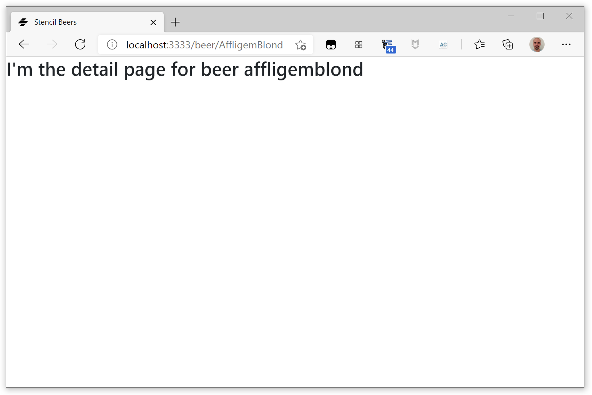
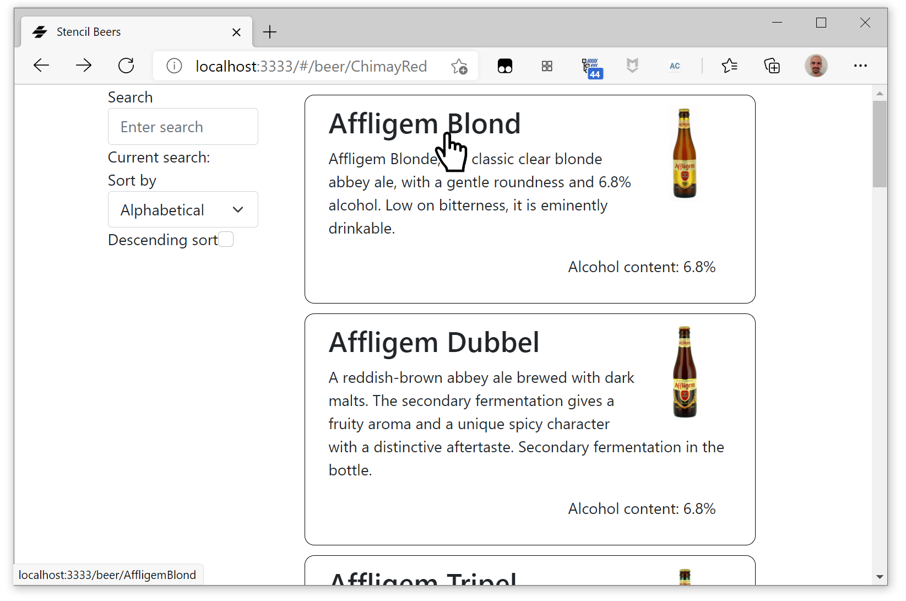

#  Stencil Beers - Step 07: Routing URLs


What if we wanted to show more details about a beer when we click on it? We can imagine opening another panel with the detailed information.

In Angular, Vue or React we would get this behavior by using a router, and defining the routing conditions in the global application definition. How can we do it with Stencil?

One of the simplest solutions is to use [Stencil Router](https://github.com/ionic-team/stencil-router), a simple router, inspired by React Router v4, for Stencil apps and vanilla Web Component apps.

We are going to use the experimental [stencil-router-v2](https://github.com/ionic-team/stencil-router/tree/v2.0.0-2) for this step. Let's install it:

```bash
npm install stencil-router-v2 --save-dev
```


## Creating a `beer-main` component

The first thing we are going to do is to create a main element that will do the routing and choose either to show the beer list or the detail on a beer.

Create a `src/components/beer-main` folder and the corresponding TypeScript and CSS files inside it:

```tsx
import { Component, Prop, State, h } from '@stencil/core';

@Component({
  tag: 'beer-main',
  styleUrl: 'beer-main.css',
})
export class BeerMain {
    render() {
        return <div class="main"></div>;
    }
}
```

```css
.main {}
```

Now we can replace `beer-list` with `beer-main` in `index.html`:

```html
<!DOCTYPE html>
<html dir="ltr" lang="en">
  <head>
    <meta charset="utf-8" />
    <meta name="viewport" content="width=device-width, initial-scale=1.0, minimum-scale=1.0, maximum-scale=5.0" />
    <title>Stencil Beers</title>

    <script type="module" src="/build/stencil-beers.esm.js"></script>
    <script nomodule src="/build/stencil-beers.js"></script>
    <link rel="stylesheet" href="/build/stencil-beers.css">
  </head>
  <body>
    <beer-main></beer-main>
  </body>
</html>
```

## Adding the router


Now let's add the router to `beer-main` and create our first routes:

```tsx
import { Component, Prop, State, h, Host } from '@stencil/core';
import { createRouter, Route, match, render } from 'stencil-router-v2';

const Router = createRouter();

@Component({
    tag: 'beer-main',
    styleUrl: 'beer-main.css',
  })
export class BeerMain {
    render() {
        return <Host>
                <Router.Switch>

                <Route path="/">
                    <beer-list></beer-list>
                </Route>


                <Route 
                    path={match('/beer/:page')}
                    render={(({page}) => <h2>I'm the detail page for beer {page}</h2>)}>
                </Route>

                </Router.Switch>
            </Host>;
    }
}
```

With this route definition, the `/` path will show the `beer-list` component, and any path beginning with `/beer/` will go to a detail placeholder for that beer.





## Hyperlinking the beers

In order to get more details on a beer when we click on its name, we need to modify `beer-list-item` rendering, to put the beer name inside a `<a>` tag that will send us to the route corresponding to that beer.

```tsx
render() {
    return <div class="container clearfix beer">    
        <a href={"/beer/"+this.id}>        
            </img>
            <h2 class="name">{this.name}</h2>
            <p class="description">{this.description}</p>
            <p class="float-end alcohol">Alcohol content: {this.alcohol}%</p>
        </a>
    </div>;
}
```

Let's also modify `beer-list-item.css` to undo the coloring and underscoring on links:

```css
.beer {
    margin: 10px;
    padding: 10px;
    border: solid 1px black;
    border-radius: 10px;
    min-height: 50px;
}

.beer a {
    text-decoration: none;
    color:inherit;
}

.beer a:hover {
    text-decoration: none;
    color:inherit;
}

.beer h2 {
    margin-top: 0;
}

.beer .alcohol {
    margin-right: 16px;
}

.beer .img {
    max-height: 100px;
}

.beer .alcohol {
    clear:both;
}
```

## Default routing

We haven't any default routing. What if we want to detect an initial unsupported route and redirect the page to the main beer list? We can do it and simplify global routing, by adding a last route that catches any not found ones:

```tsx
<Route path={NotFound}>
    <beer-list></beer-list>
</Route>
```

## Testing

And now you can go to you app, see the hyper-linked beer list, click on one of them and see the details!



