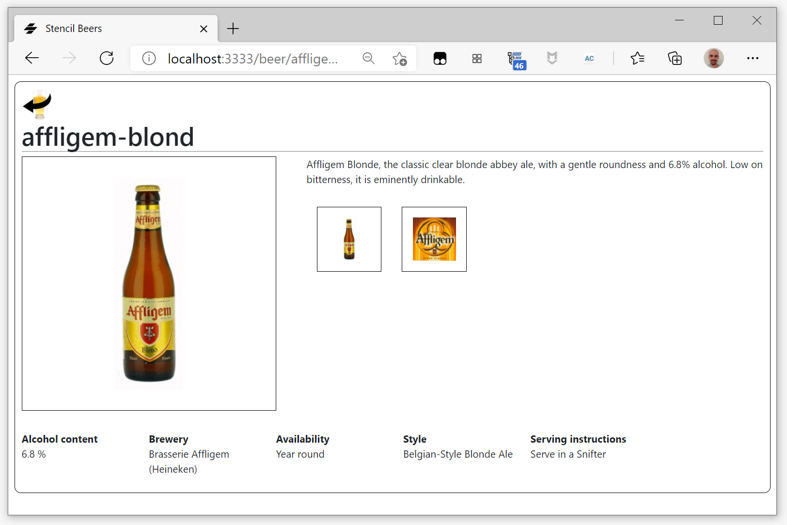
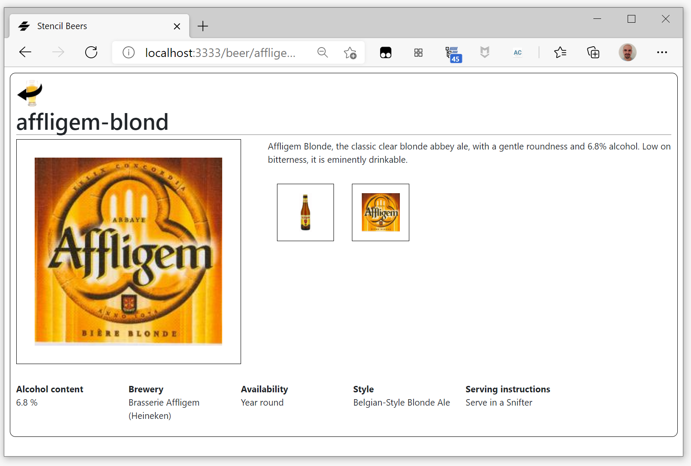

#  Stencil Beers - Step 08: Adding the details

Now we are going to have two different "pages" (or *views*) in our Stencil Beers application, one for the beer list and another for a single beer detail.

## A richer model

In the beer details there are many fields that are absent in our `Beer` interface. We could either create a new `BeerDetails` interface or simply add them as optional fieds to `Beer`. For this example we are doing this last solution, and modifying `Beer` in `utils/beers.ts`:

```ts
export interface Beer {
    id: string,
    name: string,
    description: string,
    alcohol: number,
    img: string,
    availability?: string,
    brewery?: string,
    label?: string,
    serving?: string,
    style?: string,
}
```

## Adding a beer-details component

We are going to create a `beer-details` component that calls to a *beer details* service (or in these case, a set of *beer details* JSON files) to recover and show more information on the chosen beer.


Begin by creating a new folder fore the component, `src/components/beer-details`. Inside it, create the TypeScript file to define the component, `beer-details.tsx`, and the associated CSS file, `beer-details.css`.

In the TypeScrip file, declare the component:

```tsx
import { Component, Prop, State, h } from '@stencil/core';
import { Beer } from '../../utils/beers';

@Component({
  tag: 'beer-details',
  styleUrl: 'beer-details.css',
})
export class BeerDetails {

    render() {
        return <div class="beer-details"></div>
    }
}
```

The component receives a *beer id*  and use it to load the beer details a *beer details* service (or in these case, a set of *beer details* JSON files). Then it keeps the response as an internal State. To do that we need to declare a Prop property for the beer id and a State property for the beer details:

```tsx
@Prop() id: string;
@State() beer: Beer;
```

And we need to load the beer details at the moment the component is created (`connectedCallback()` lifecycle method) and reload them at every change of `id` (i.e. we need a Watch). In both cases we need an `async` function that calls the JSON file:

```tsx
connectedCallback() {
    console.log('Connected Callback', this.beerId);
    this._getData();
}

@Watch('beerId')
async _getData() {
    console.log('I got called');
    if (this.beerId === undefined) return;
    try {
        const response = await fetch(`/data/beers/details/${this.beerId}.json`);
        this.beer = await response.json();
    }
    catch (err) {
        console.log('fetch failed', err);
    }
}

```

Now we can write the `render()`:

```tsx
render() {
    return <div id={this.beer.id} class="detail clearfix">
    
        <a href="/">
            
        </a>
        <h1 class="name">{this.beer.name}</h1>
    
        
    
        <p class="description">{this.beer.description}</p>

        <ul class="beer-thumbs">
            <li>
                
            </li>
            <li>
                
            </li>
        </ul>
        <ul class="specs">
            <li>
                <dl>
                <dt>Alcohol content</dt>
                <dd>{this.beer.alcohol} %</dd>
                </dl>
            </li>
            <li>
                <dl>
                <dt>Brewery</dt>
                <dd>{this.beer.brewery}</dd>
                </dl>
            </li>
            <li>
                <dl>
                <dt>Availability</dt>
                <dd>{this.beer.availability}</dd>
                </dl>
            </li>
            <li>
                <dl>
                <dt>Style</dt>
                <dd>{this.beer.style}</dd>
                </dl>
            </li>
            <li>
                <dl>
                <dt>Serving instructions</dt>
                <dd>{this.beer.serving}</dd>
                </dl>
            </li>
        </ul>
    </div>;
}
```

Let's add some CSS to make that prettier:

```css
.detail {
margin: 10px;
padding: 10px;
border: solid 1px black;
border-radius: 10px;
min-height: 150px;
}
.detail .back {
width: 50px;
height: 50px;
}
.detail .img {
float: left;
border: 1px solid black;
margin-right: 3em;
margin-bottom: 2em;
background-color: white;
padding: 2em;
height: 400px;
width: 400px;
}
.detail .alcohol {
clear:both;
}

.detail ul.beer-thumbs {
margin: 0;
list-style: none;
}

.detail ul.beer-thumbs li {
border: 1px solid black;
display: inline-block;
margin: 1em;
background-color: white;
}

.detail ul.beer-thumbs img {
height: 100px;
width: 100px;
padding: 1em;
}

.detail ul.specs {
clear: both;
margin: 0;
padding: 0;
list-style: none;
}

.detail ul.specs > li{
display: inline-block;
width: 200px;
vertical-align: top;
}

.detail ul.specs > li > span{
font-weight: bold;
font-size: 1.2em;
}

.detail ul.specs dt {
font-weight: bold;
}

.detail h1 {
border-bottom: 1px solid gray;
}
```


Now we can use `beer-detail` in `beer-main` to replace the simple message we had set:

```tsx
<Route 
    path={match('/beer/:page')}
    render={(({page}) =>  <beer-details beerId={page} />)}>
</Route>
```




## Let's add some more dynamism

To make it even prettier, we would like that instead of always showcasing the main image, when we click on the label or main thumbnails, the chosen image was showcased.

Let's add a new State, `currentImage`, and make it change when we click on a thumnail.


Let's begin by adding the State, and initializing it

```tsx
    @State() currentImg: string;

    @Watch('beerId')
    async _getData() {
        console.log('I got called');
        if (this.beerId === undefined) return;
        try {
            const response = await fetch(`/data/beers/details/${this.beerId}.json`);
            this.beer = await response.json();
            this.currentImg = this.beer.img;
        }
        catch (err) {
            console.log('fetch failed', err);
        }
    }
```

Now let's add some click listeners in the thumbnails, and make them change `currentImg`:

```tsx


<p class="description">{this.beer?.description}</p>

<ul class="beer-thumbs">
    <li>
         this.currentImg = this.beer.img } />
    </li>
    <li>
         this.currentImg = this.beer.label } />
    </li>
</ul>
```



